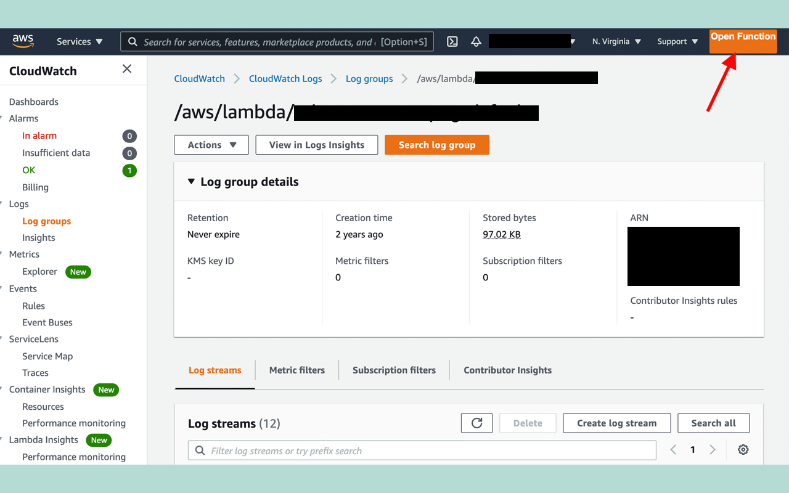

# Lambda Shortcut

Lambda Shortcut is a Google Chrome extension that creates a button in the AWS CloudWatch UI when you are in Lambda logs to navigate to your Lambda function.

This has no affiliation with AWS or Amazon.

## Installation

Until Google accepts my app submission, you'll need to zip up this repo and follow [these steps](https://developer.chrome.com/docs/extensions/mv2/getstarted/)

## Contributing
Pull requests are welcome. For major changes, please open an issue first to discuss what you would like to change.